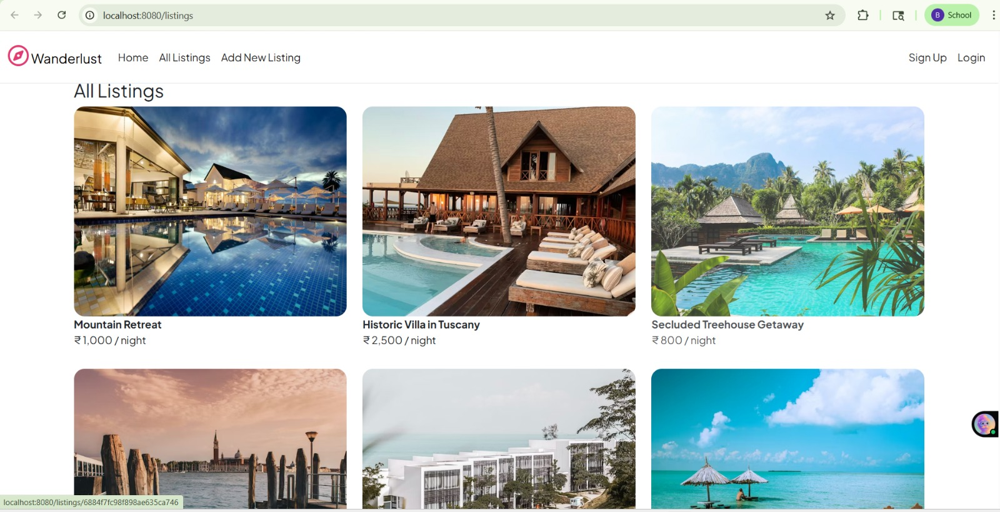
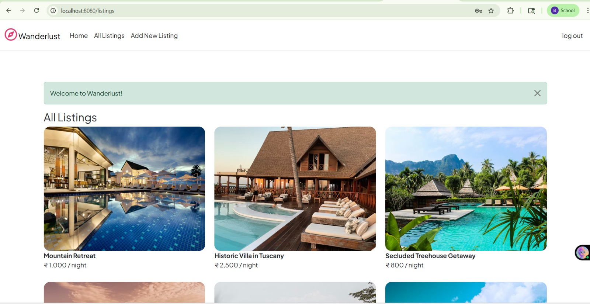
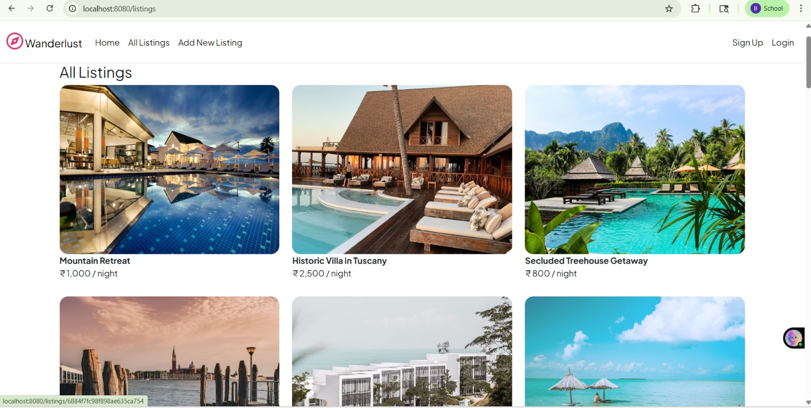
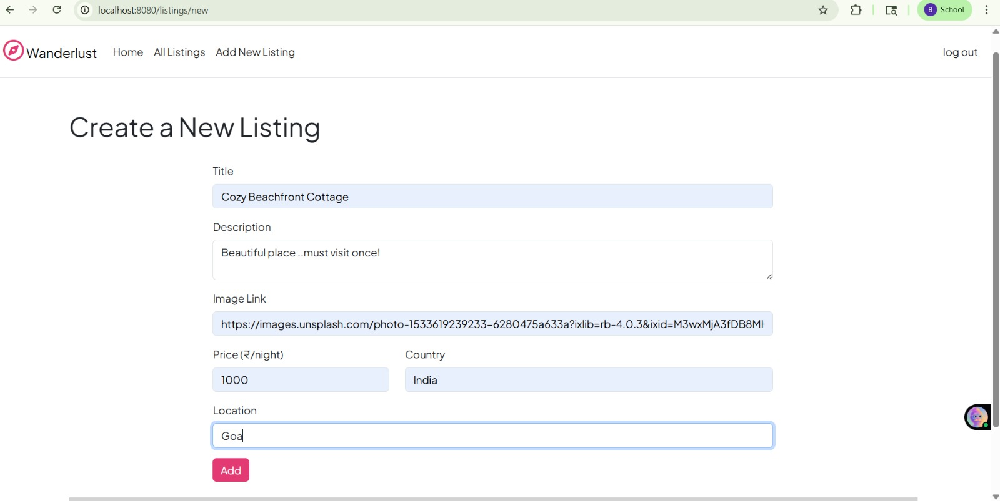

# 🏡 Wanderlust – Airbnb Clone

## 📌 Description
A full-stack web application inspired by Airbnb that allows users to explore, create, and manage rental listings. Built using Node.js, Express.js, MongoDB, and EJS.

---

## 🚀 Features
- Browse listings with images, prices, and locations  
- User authentication (Login/Signup)  
- Add, edit, and delete listings  
- Review and rating system  
- Responsive design  

---

## 🛠️ Tech Stack
- Node.js  
- Express.js  
- MongoDB  
- EJS  
- Bootstrap  
- Passport.js  

---

## 📸 Demo

### 🏠 Homepage


### 🔐 Login Page


### 📄 Listing Details


### ➕ Add New Listing


---

## 🌐 Live Demo
👉 https://wanderlust-airbnb-clone.onrender.com

---

## 💻 Requirements
- Node.js  
- MongoDB  

---

## ⚙️ Setup & Installation

### 1. Clone the repository
```bash
git clone https://github.com/PriyanshuKumari1409/Wanderlust-Airbnb-Clone.git
cd Wanderlust-Airbnb-Clone
```

### 2. Install dependencies: 
```bash
npm install
```

### 3. Run the project 
```bash
node app.js
```

## 🎯 Usage
- Browse listings from homepage
- Sign up / Login to access features
- Add new listings
- Edit or delete your listings
- Add reviews to listings


## 📂 Project Structure
```bash
Wanderlust-Airbnb-Clone/
│── models/
│── routes/
│── views/
│── public/
│── utils/
│── app.js
│── package.json
```

## 🌟 Future Improvements
- Payment integration
- Booking system
- Map integration

## 👨‍💻 Author
Priyanshu Kumari  
GitHub: https://github.com/PriyanshuKumari1409